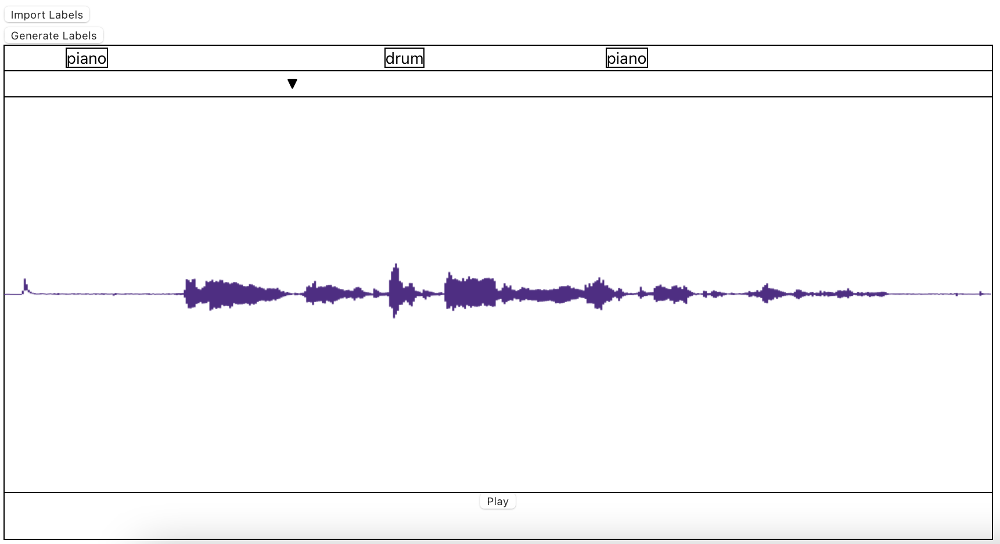

## About
Continuous Object Detector (C.O.D.) is a tool designed to help audio engineers with visual impairments more quickly get to locations within tracks that they are trying to find.

A common problem that occurs in the audio engineering workflow is having to process many tracks at once. Consider a day of heavy recording at the studio: When you get back, you'll have to import the 80 or so tracks that you've recorded and manually comb through them to apply labels and figure out what's what. This process can take painstakingly long, but using the latest technology in sound event detection (SED) machine learning research makes the task fully automatable.

We created a proof of concept that is intended to simulate the experience we hope to bring to a digital audio workstation (DAW). Digital audio workstations are the state of the art audio editing and creation tools. Notable examples include Logic Pro, Pro Tools, Ableton, FL Studio, Reaper, etc.

Our solution provides labels for tracks with precision of one second. Not only that, we added custom navigation features that allow us to more easily move between labels with the same name, such as a "Piano" label at 5 seconds to a "Piano" label at 15 seconds. These labels are screenreader friendly and tested with NVDA on Windows and VoiceOver on macOS.

## Interface
[Try it out](https://cod-audio.github.io/cod/) | [View the Source](https://github.com/cod-audio/cod)

Above is an example of a labeled track in our system. The labels are placed at their onset (start) time and the playhead (black upside down triangle) can be used to move around the track. At the bottom of the screen is a play/plause button. There are several navigation controls listed on the website that can be used to move about the labels more easily. Our current implementation also supports adding manual labels.

The goal of the interface is to emulate the track list of a DAW. Currently, there is only support for one track. To reset the interface, simply refreshing the page will clear the layout.

The interface was created using React.

## Model

## Backend
[View the Source](https://github.com/cod-audio/cod-api)
